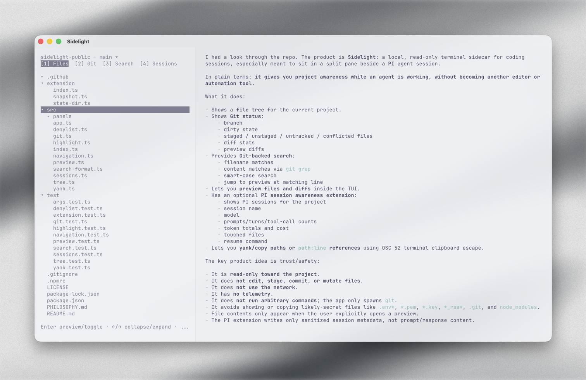
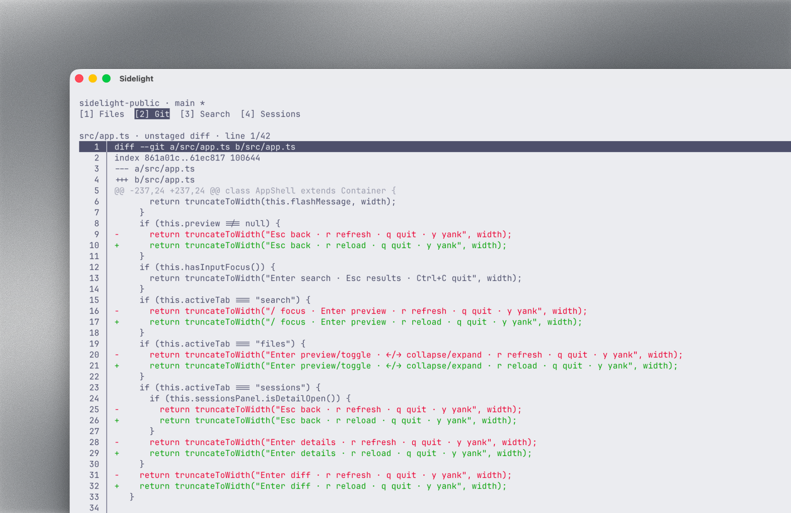
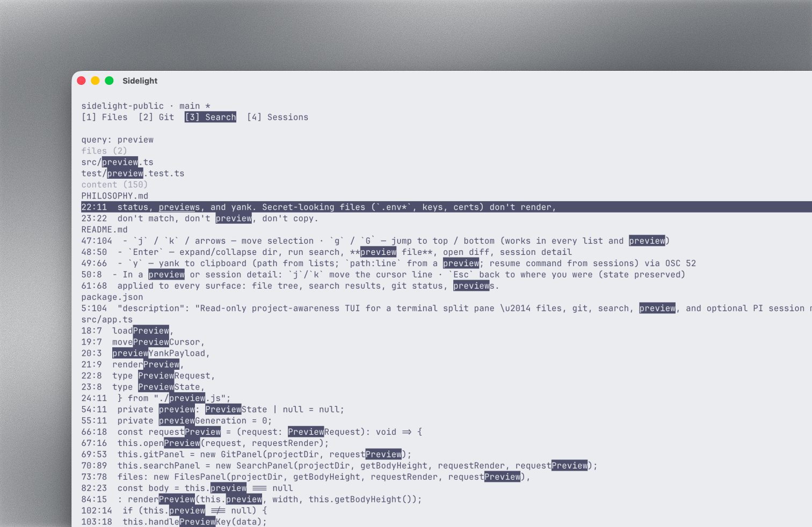
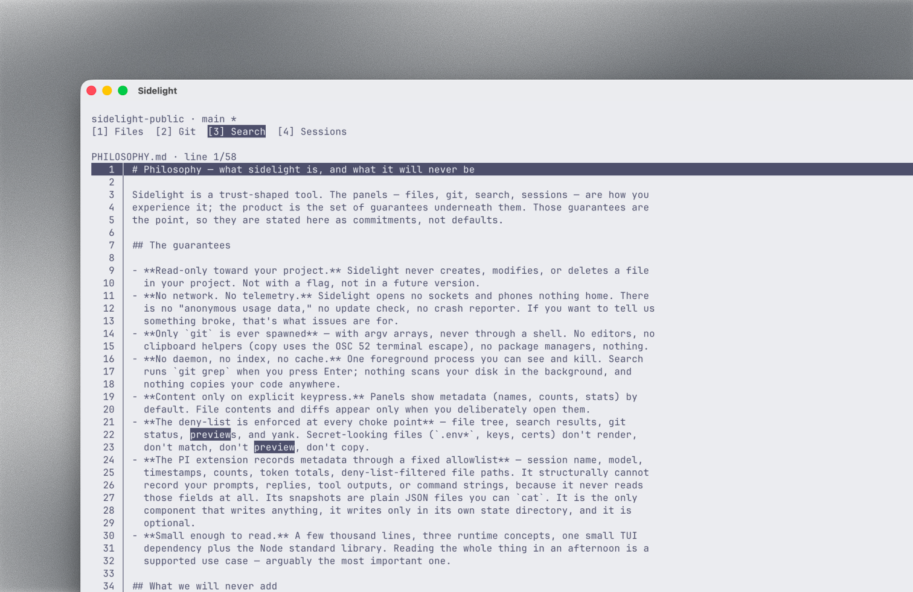
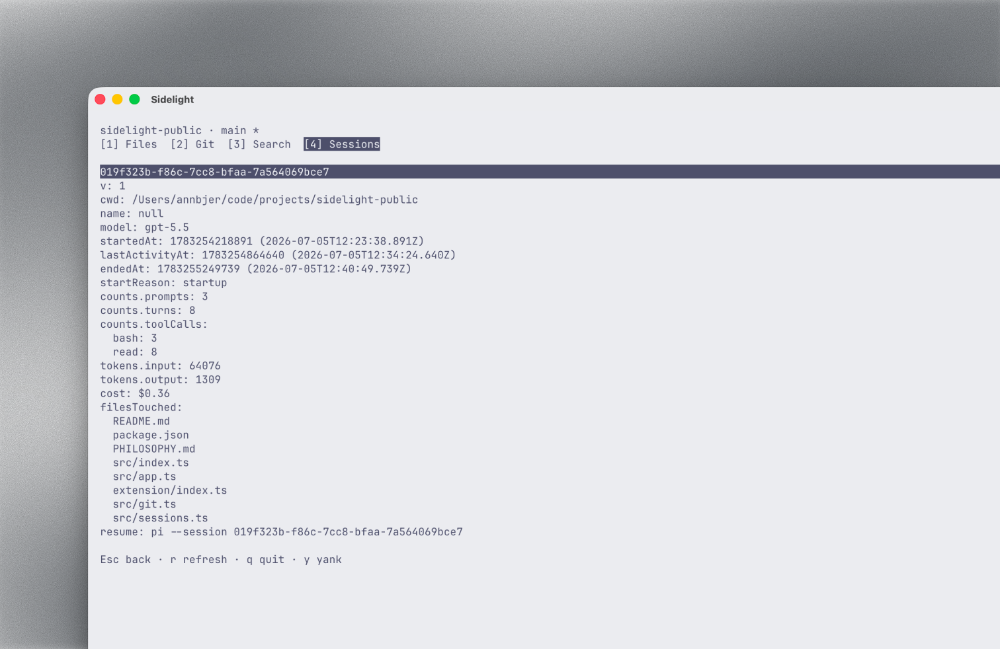

# sidelight

Read-only project-awareness TUI for a terminal split pane beside your AI coding agent —
[PI](https://pi.dev), Claude Code, or Codex. Runs entirely locally: no network, no telemetry,
the sidecar never writes, and it only ever spawns `git`.


**Why:** full visibility into the project you're working on — and transparency into
what your AI agent is actually touching — without handing yet another tool write
access to your code.

<picture>
  <source media="(prefers-color-scheme: dark)" srcset="assets/1-hero-dark.png">
  
</picture>

## Install

From [npm](https://www.npmjs.com/package/sidelight):

```sh
npm install -g sidelight
sidelight [dir]   # dir defaults to the current directory
```

Or from source, if you prefer to read before you run (encouraged):

```sh
git clone https://github.com/annbjer/sidelight && cd sidelight
npm install && npm run build
node dist/src/index.js [dir]
```

## Use in Ghostty

Open a split (`cmd+d` right / `cmd+shift+d` down), size it to taste
(`cmd+ctrl+arrows`), and run `sidelight` in the split next to `pi`.

## PI session awareness (v0.2)

The `[4] Sessions` tab shows your project's PI sessions live (name, activity, prompts,
model, cost). It needs the bundled PI extension, which records **sanitized metadata
only** — never message content. Enable it with:

```sh
pi install npm:sidelight
```

Or try it once without installing: `pi -e npm:sidelight`. Running from a clone instead?
Point `~/.pi/agent/settings.json` at it: `"extensions": ["<path-to-repo>/extension/index.ts"]`.

The extension writes one small JSON snapshot per session under
`~/.local/state/sidelight/sessions/` (or `$XDG_STATE_HOME/sidelight/sessions/`) —
open one with `cat` to see exactly what is recorded: timestamps, counts, tool-call
counts, deny-list-filtered file paths, token totals, cost, the model id, and the session
name you set with `/name`. Nothing else.

## Other agents: Claude Code and Codex (v0.6)

The same Sessions tab works beside Claude Code and Codex through their hooks systems.
Each adapter is a tiny program that ships with sidelight, runs for milliseconds per
event, and records the same sanitized metadata — never message content, never command
strings. Setup is one command:

**Claude Code:**

```sh
sidelight-claude-code-hook --install
```

**Codex:**

```sh
sidelight-codex-hook --install
```

Each shows you the exact change to your agent's config, makes a timestamped backup, and
asks before writing — nothing happens without your explicit yes. `--uninstall` reverses
it just as cleanly, and `--print-config` prints the snippet if you prefer to merge by
hand.

Codex asks you to trust the hooks on first interactive run (non-interactive
`codex exec` needs `--dangerously-bypass-hook-trust`).

Honest limitations, by design: `tokens`/`cost` stay at 0 for both (their hooks don't
expose usage, and sidelight never parses message-bearing transcripts); Codex mostly runs
files through shell commands, so its `filesTouched` stays sparse (command strings are
never read); Codex has no session-end event, so its sessions display as active.

## Keys

- `1` / `2` / `3` / `4` — Files / Git / Search / Sessions panel
- `j` / `k` / arrows — move selection · `g` / `G` — jump to top / bottom (works in every list and preview)
- `Enter` — expand/collapse dir, run search, **preview file**, open diff, session detail
- `y` — yank to clipboard (path from lists; `path:line` from a preview; resume command from sessions) via OSC 52
- In a preview or session detail: `j`/`k` move the cursor line · `Esc` back to where you were (state preserved)
- `/` — jump to search input · `Esc` — toggle input/results focus
- Search is smart-case: all-lowercase queries match any case; an uppercase letter makes it exact
- Search results: `files` section (filename matches) first, then `content` matches, query highlighted
- `r` — refresh all panels (git status and sessions also auto-refresh via fs watchers)
- `q` / `Ctrl+C` — quit


## A closer look

**Review what your agent changed — diff stats on every file, colored diffs on Enter.**

<picture>
  <source media="(prefers-color-scheme: dark)" srcset="assets/2-git-dark.png">
  
</picture>


**Search finds files and content — smart-case, every match highlighted.**

<picture>
  <source media="(prefers-color-scheme: dark)" srcset="assets/3-search-dark.png">
  
</picture>


**Preview any file or match at its exact line, then Esc back to where you were.**

<picture>
  <source media="(prefers-color-scheme: dark)" srcset="assets/3-search-2-dark.png">
  
</picture>


**Know what each agent session touched — and what it cost.**

<picture>
  <source media="(prefers-color-scheme: dark)" srcset="assets/4-sessions-dark.png">
  
</picture>

## Guarantees

- Respects `.gitignore` (files/search built on `git ls-files` / `git grep`) plus a
  built-in deny-list (`.env*`, `*.pem`, `*.key`, `*_rsa*`, `node_modules`, `.git`)
  applied to every surface: file tree, search results, git status, previews.
- The sidecar is read-only: never modifies, writes, or indexes anything.
- The session recorders (PI extension, Claude Code and Codex hook adapters) write only
  their own state dir, only allowlisted metadata fields, and never message bodies,
  prompts, or command strings.
- Works degraded outside git repos (deny-listed file browser; search disabled) and
  without the extension (Sessions tab shows how to enable it).

## Philosophy

Sidelight is deliberately restrained: read-only toward your project, no network, no
telemetry, no daemon, no index, content only on explicit keypress. The boundaries are a
feature — see [PHILOSOPHY.md](./PHILOSOPHY.md) for the guarantees and the list of
things we will never add.

## Support

Sidelight is free and open source. If it helps your workflow, you can support
development at [ko-fi.com/annbjer](https://ko-fi.com/annbjer).

## The story

How (and why) sidelight was built — one human, three AIs, one hot July weekend:
[annbjer.com/articles/sidelight-the-visibility-layer-my-terminal-was-missing](https://www.annbjer.com/articles/sidelight-the-visibility-layer-my-terminal-was-missing/)
